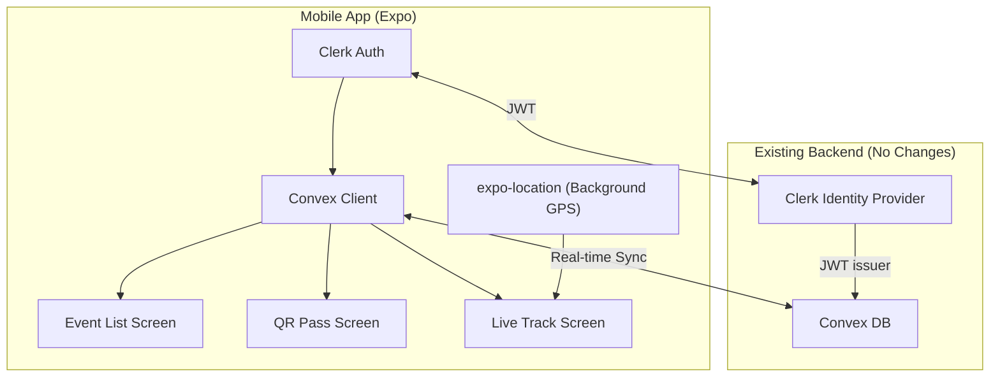

# RaceDay Companion App — Overview

> A lightweight companion mobile app for runners using the RaceDay platform.

## Why a Companion App?

The primary motivation is **Live Tracking** — the browser-based Geolocation API (`navigator.geolocation.watchPosition`) stops sending GPS updates when the phone screen is locked or the browser is backgrounded. A native app can use background location services to keep tracking alive for the entire race duration.

Secondary features are minimal "runner dashboard" views that are more convenient from a phone during race day.

---

## Recommended Tech Stack

| Layer | Choice | Rationale |
|---|---|---|
| **Framework** | **Expo (React Native)** | Same language (TypeScript/React) as the Next.js web app. Expo's managed workflow handles native builds, OTA updates, push notifications, and app store submissions without needing Xcode/Android Studio expertise. |
| **Backend** | **Convex** (existing) | The `convex` npm package works in React Native. All queries, mutations, and real-time subscriptions stay exactly the same — zero backend changes needed. |
| **Auth** | **Clerk** (`@clerk/clerk-expo`) | Official Clerk SDK for Expo/React Native. Uses the same Clerk instance as the web app, so users log in with the same account. JWT integration with Convex stays identical. |
| **Background GPS** | **`expo-location`** | Provides `Location.startLocationUpdatesAsync()` for background location tracking that persists when the screen is locked or the app is backgrounded. This is the killer feature that the browser can't do. |
| **Maps** | **`react-native-maps`** | Native MapView with GPX route overlay. Far more performant than Leaflet in a native context. |
| **QR Display** | **`react-native-qrcode-svg`** | Renders the race kit claim QR code natively. No network request needed — generates from registration ID. |
| **Navigation** | **Expo Router** | File-based routing (similar to Next.js App Router). Familiar patterns for the existing codebase. |
| **Notifications** | **`expo-notifications`** | Push notifications for race announcements (Stage 4). |

### Why Expo over bare React Native / Flutter?

1. **Code reuse** — TypeScript + React, same mental model as the Next.js app
2. **Convex SDK** — Works directly with `convex/react` hooks (`useQuery`, `useMutation`)
3. **No native code required** — `expo-location` background tracking works in managed workflow
4. **EAS Build** — Cloud builds for both iOS and Android without local Xcode/Android Studio
5. **OTA Updates** — Push JS updates without app store review

---

## Scope — What the App Does

| Feature | Priority | Stage |
|---|---|---|
| Clerk login (same account as web) | **Must have** | 1 |
| View registered events | **Must have** | 2 |
| View race kit QR code | **Must have** | 2 |
| Live tracking with background GPS | **Must have** | 3 |
| View live map with other runners | **Must have** | 3 |
| Push notifications (announcements) | Nice to have | 4 |
| Event discovery & registration | Out of scope | — |

> [!IMPORTANT]
> Event registration & payment stays web-only. The app is a **companion**, not a replacement.

---

## Stage Breakdown

| Stage | File | Focus |
|---|---|---|
| Stage 1 | [`stage-1-foundation.md`](file:///Users/chinoyoung/Code/raceday-next/plan/companion-app/stage-1-foundation.md) | Project setup, Expo config, Clerk auth, Convex client |
| Stage 2 | [`stage-2-core-features.md`](file:///Users/chinoyoung/Code/raceday-next/plan/companion-app/stage-2-core-features.md) | Event list, event details, QR pass screen |
| Stage 3 | [`stage-3-live-tracking.md`](file:///Users/chinoyoung/Code/raceday-next/plan/companion-app/stage-3-live-tracking.md) | Background GPS, live map, route overlay |
| Stage 4 | [`stage-4-polish-release.md`](file:///Users/chinoyoung/Code/raceday-next/plan/companion-app/stage-4-polish-release.md) | Push notifications, app store submission, OTA updates |

---

## Architecture Diagram

> [!NOTE]
> The existing Convex backend requires **zero changes**. The same `api.registrations.getByUserId`, `api.tracking.start`, `api.tracking.update`, etc. work from both web and mobile.
