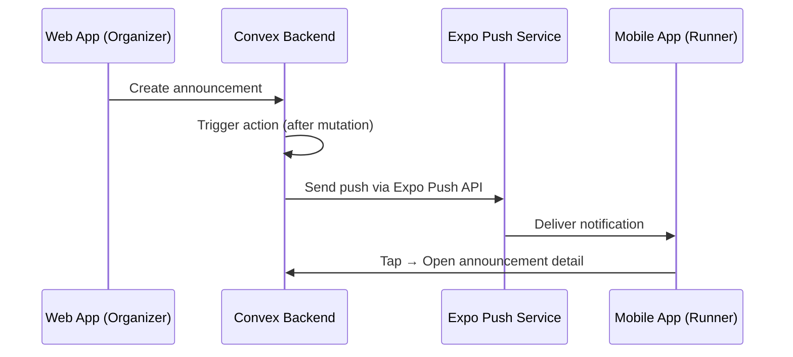

# Stage 4 — Polish & Release

> **Goal**: Push notifications, app store submission, OTA updates, and final polish.

---

## 4.1 — Push Notifications (Announcements)

When an organizer posts an announcement on the web app, registered runners should receive a push notification on their phone.

### Setup:

```bash
npx expo install expo-notifications expo-device expo-constants
```

### Architecture:



### Backend Addition:

Store the Expo push token in the `users` table:

```typescript
// Schema addition to users table
expoPushToken: v.optional(v.string()),
```

### Convex Action to Send Push:

```typescript
// convex/notifications.ts (new file)
import { internalAction } from "./_generated/server";
import { v } from "convex/values";

export const sendPush = internalAction({
  args: {
    tokens: v.array(v.string()),
    title: v.string(),
    body: v.string(),
    data: v.optional(v.any()),
  },
  handler: async (ctx, args) => {
    const messages = args.tokens.map(token => ({
      to: token,
      sound: "default",
      title: args.title,
      body: args.body,
      data: args.data || {},
    }));

    await fetch("https://exp.host/--/api/v2/push/send", {
      method: "POST",
      headers: { "Content-Type": "application/json" },
      body: JSON.stringify(messages),
    });
  },
});
```

### Mobile Side — Register Token:

```typescript
import * as Notifications from "expo-notifications";
import { useMutation } from "convex/react";
import { api } from "@/convex/_generated/api";

async function registerForPush(userId: string) {
  const { status } = await Notifications.requestPermissionsAsync();
  if (status !== "granted") return;

  const token = (await Notifications.getExpoPushTokenAsync()).data;
  // Save to Convex user record
  await updatePushToken({ userId, expoPushToken: token });
}
```

---

## 4.2 — App Icon & Splash Screen

Use Expo's asset system:

```json
// app.json
{
  "expo": {
    "name": "RaceDay",
    "slug": "raceday",
    "icon": "./assets/icon.png",         // 1024x1024
    "splash": {
      "image": "./assets/splash.png",     // 1284x2778
      "resizeMode": "cover",
      "backgroundColor": "#1f2937"
    },
    "ios": {
      "bundleIdentifier": "com.raceday.app",
      "supportsTablet": false
    },
    "android": {
      "package": "com.raceday.app",
      "adaptiveIcon": {
        "foregroundImage": "./assets/adaptive-icon.png",
        "backgroundColor": "#1f2937"
      }
    }
  }
}
```

### Assets Needed:

| Asset | Size | Notes |
|---|---|---|
| `icon.png` | 1024×1024 | App icon (use RaceDay logo) |
| `adaptive-icon.png` | 1024×1024 | Android adaptive icon foreground |
| `splash.png` | 1284×2778 | Splash screen (dark background + logo) |

---

## 4.3 — EAS Build & Submit

### Setup EAS:

```bash
npm install -g eas-cli
eas login
eas build:configure
```

### Build profiles (`eas.json`):

```json
{
  "build": {
    "development": {
      "developmentClient": true,
      "distribution": "internal"
    },
    "preview": {
      "distribution": "internal",
      "ios": {
        "simulator": false
      }
    },
    "production": {
      "autoIncrement": true
    }
  },
  "submit": {
    "production": {
      "ios": {
        "appleId": "your@email.com",
        "ascAppId": "your-app-store-connect-id"
      },
      "android": {
        "serviceAccountKeyPath": "./google-service-account.json"
      }
    }
  }
}
```

### Build commands:

```bash
# Development build (internal testing)
eas build --platform all --profile development

# Preview build (TestFlight / Internal Testing)
eas build --platform all --profile preview

# Production build
eas build --platform all --profile production

# Submit to stores
eas submit --platform all
```

---

## 4.4 — OTA Updates

Expo's EAS Update allows pushing JavaScript bundle updates without app store review:

```bash
npx expo install expo-updates
```

```json
// app.json addition
{
  "expo": {
    "updates": {
      "url": "https://u.expo.dev/your-project-id"
    },
    "runtimeVersion": {
      "policy": "sdkVersion"
    }
  }
}
```

```bash
# Push an update
eas update --branch production --message "Fixed event card layout"
```

> [!TIP]
> OTA updates can fix bugs and add features instantly — no app store review wait time. Only native code changes (new permissions, SDK upgrades) require a new build.

---

## 4.5 — Final Polish Checklist

### UX Polish:
- [ ] Loading skeletons matching web app style
- [ ] Pull-to-refresh on events list
- [ ] Haptic feedback on button presses (`expo-haptics`)
- [ ] Smooth page transitions
- [ ] Error boundaries with friendly messages
- [ ] Empty states with illustrations

### Performance:
- [ ] Image caching (`expo-image` instead of `<Image>`)
- [ ] Lazy loading for event detail screens
- [ ] Minimize re-renders with proper `useQuery` placement

### Accessibility:
- [ ] VoiceOver / TalkBack labels on all interactive elements
- [ ] Sufficient color contrast (already good with dark theme)
- [ ] Touch targets minimum 44×44 points

### Testing:
- [ ] Test on iOS 16+ and Android 10+
- [ ] Test background tracking on real devices (not simulators)
- [ ] Test with poor network connectivity
- [ ] Test QR display at various screen sizes
- [ ] Test deep links from push notifications

---

## 4.6 — App Store Requirements

### iOS (App Store):
- [ ] Privacy policy URL
- [ ] App Store screenshots (6.7" + 5.5" iPhone)
- [ ] App description & keywords
- [ ] Background location usage justification (Apple reviews this carefully)
- [ ] Health & fitness category

### Android (Google Play):
- [ ] Privacy policy URL
- [ ] Feature graphic (1024×500)
- [ ] Phone screenshots
- [ ] Background location usage declaration
- [ ] Target SDK level compliance
- [ ] Data safety section

> [!CAUTION]
> Apple **carefully reviews** background location usage. The justification must clearly explain that it's for **live race tracking** during athletic events. Include screenshots showing the tracking UI and explain that tracking is user-initiated and time-bound (race duration only).

---

## Timeline Estimate

| Stage | Effort | Notes |
|---|---|---|
| Stage 1: Foundation | 1-2 days | Mostly boilerplate + auth config |
| Stage 2: Core Features | 2-3 days | Screens + QR display |
| Stage 3: Live Tracking | 3-5 days | Background GPS + map + HTTP action |
| Stage 4: Polish & Release | 2-3 days | Notifications + store submission |
| **Total** | **~8-13 days** | |

---

## Deliverables

- [ ] Push notifications for event announcements
- [ ] App icon, splash screen, and branding
- [ ] EAS Build configured for iOS + Android
- [ ] TestFlight / Internal Testing builds
- [ ] App store listings prepared
- [ ] OTA update pipeline configured
- [ ] Production build submitted to both stores
